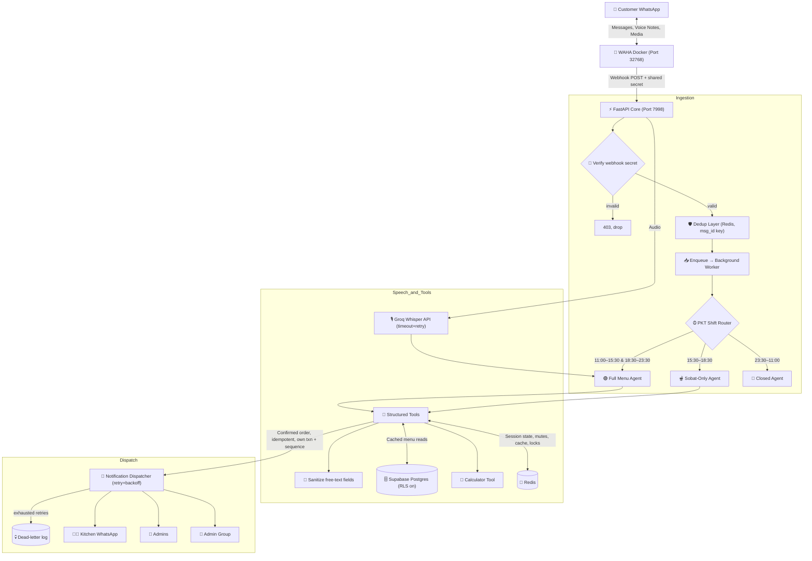

# 🍽️ Pace Restaurant WhatsApp AI Agent — Implementation Plan (v3)

Builds on v2. All credentials below are placeholders (`${VAR}`) — never commit
real values. See [Section 13](#13-secrets-management).

**What changed vs. v2:** distributed locks so scheduled jobs are safe with
>1 replica, webhook shared-secret verification, an `ALLOWED_NUMBERS` gate that
is actually wired up, injection-resistant handling of free-text order fields,
session-level idempotency on order confirmation (not just message-level
dedup), and structured logging with a dead-letter path for exhausted retries.

---

## 📑 Table of Contents
1. [System Architecture Overview](#1-system-architecture-overview)
2. [Environment Configuration](#2-environment-configuration)
3. [Database Schema & Row-Level Security](#3-database-schema--row-level-security)
4. [WhatsApp Gateway Setup (WAHA)](#4-whatsapp-gateway-setup-waha)
5. [FastAPI Application Core](#5-fastapi-application-core)
6. [Webhook Auth, Dedup & Async Processing](#6-webhook-auth-dedup--async-processing)
7. [Session State & Order Lifecycle (Idempotent)](#7-session-state--order-lifecycle-idempotent)
8. [Multi-Agent Operational Architecture](#8-multi-agent-operational-architecture)
9. [Deterministic Tool Calling Engine](#9-deterministic-tool-calling-engine)
10. [Voice Note Processing](#10-voice-note-processing)
11. [WhatsApp In-Chat Admin Commands (Secured)](#11-whatsapp-in-chat-admin-commands-secured)
12. [Scheduled Jobs with Distributed Locking](#12-scheduled-jobs-with-distributed-locking)
13. [Secrets Management](#13-secrets-management)
14. [Docker Hardening](#14-docker-hardening)
15. [CI/CD: GitHub → Hostinger VPS Deployment](#15-cicd-github--hostinger-vps-deployment)
16. [Observability & Dead-Letter Handling](#16-observability--dead-letter-handling)
17. [Operational Checklist](#17-operational-checklist)

---

## 1. System Architecture Overview



---

## 2. Environment Configuration

```env
# ── OpenAI ──
OPENAI_API_KEY=${OPENAI_API_KEY}

# ── WhatsApp Gateway (WAHA) ──
WAHA_API_URL=${WAHA_API_URL}
WAHA_API_KEY=${WAHA_API_KEY}
WAHA_SESSION=Pace
WAHA_WEBHOOK_SECRET=${WAHA_WEBHOOK_SECRET}   # NEW: verified on every inbound webhook

# ── Supabase (service role, server-side only) ──
SUPABASE_URL=${SUPABASE_URL}
SUPABASE_SERVICE_KEY=${SUPABASE_SERVICE_KEY}
SUPABASE_TABLE=pace_orders
SUPABASE_MENU_TABLE=MenuPace

# ── Redis (session state, dedup, cache, distributed locks) ──
REDIS_URL=${REDIS_URL}

# ── Access control ──
ALLOWED_NUMBERS_ONLY=false
ALLOWED_NUMBERS=${ALLOWED_NUMBERS}           # comma-separated E.164 numbers; now enforced, see §6

# ── Restaurant details ──
RESTAURANT_NAME=Pace Restaurant
RESTAURANT_CITY=Dera Ismail Khan
RESTAURANT_ADDRESS=East Circular Road, Topan Wala Chowk, Dera Ismail Khan
RESTAURANT_PHONE=0966-716555
RESTAURANT_MOBILE=0332-2716555
ADMIN_WHATSAPP=${ADMIN_WHATSAPP}
ADMIN_2_WHATSAPP=${ADMIN_2_WHATSAPP}
KITCHEN_WHATSAPP=${KITCHEN_WHATSAPP}
ADMIN_GROUP_JID=${ADMIN_GROUP_JID}
MINIMUM_DELIVERY_ORDER=300

# ── Menu assets ──
MENU_IMAGE_1=${MENU_IMAGE_1}
MENU_IMAGE_2=${MENU_IMAGE_2}

# ── Server ──
APP_HOST=0.0.0.0
APP_PORT=7998
DEBUG=false
ORDER_CONFIRM_TIMEOUT_MIN=10

# ── Observability ──
LOG_LEVEL=INFO
SENTRY_DSN=${SENTRY_DSN}                     # optional but recommended, see §16
```

---

## 3. Database Schema & Row-Level Security

```sql
-- 1. Live Menu Table
CREATE TABLE IF NOT EXISTS "MenuPace" (
    id UUID PRIMARY KEY DEFAULT gen_random_uuid(),
    name TEXT NOT NULL,
    category TEXT NOT NULL,
    price NUMERIC NOT NULL,
    variant TEXT,
    available BOOLEAN DEFAULT true,
    description TEXT,
    created_at TIMESTAMPTZ DEFAULT now()
);

-- 2. Orders Table — order_id generated by DB, not app code (avoids race conditions)
CREATE SEQUENCE IF NOT EXISTS pace_order_seq START 1;

CREATE TABLE IF NOT EXISTS "pace_orders" (
    order_id TEXT PRIMARY KEY DEFAULT
        'PACE-' || to_char(now(), 'YYYYMMDD') || '-' ||
        LPAD(nextval('pace_order_seq')::TEXT, 5, '0'),
    session_confirm_key TEXT UNIQUE,   -- NEW: idempotency guard, see §7
    customer_name TEXT NOT NULL,
    phone_number TEXT NOT NULL,
    order_type TEXT NOT NULL,          -- 'Delivery' or 'Takeaway'
    delivery_address TEXT,
    pickup_time TEXT,
    order_items TEXT NOT NULL,
    total_bill NUMERIC NOT NULL,
    subtotal NUMERIC,
    thal_deposit NUMERIC DEFAULT 0,
    status TEXT DEFAULT 'Pending',     -- 'Pending','Confirmed','Dispatched','Cancelled','Expired'
    notes TEXT,
    created_at TIMESTAMPTZ DEFAULT now()
);

-- 3. Customer Profile History
CREATE TABLE IF NOT EXISTS "customer_profiles" (
    phone_number TEXT PRIMARY KEY,
    customer_name TEXT,
    default_address TEXT,
    total_orders INTEGER DEFAULT 0,
    last_order_items TEXT,
    last_ordered_at TIMESTAMPTZ DEFAULT now()
);

-- 4. Admin action audit log
CREATE TABLE IF NOT EXISTS "admin_actions" (
    id BIGSERIAL PRIMARY KEY,
    actor_jid TEXT NOT NULL,
    command TEXT NOT NULL,
    target TEXT,
    created_at TIMESTAMPTZ DEFAULT now()
);

-- 5. Dead-letter log for exhausted external-call retries (NEW, see §16)
CREATE TABLE IF NOT EXISTS "failed_dispatches" (
    id BIGSERIAL PRIMARY KEY,
    kind TEXT NOT NULL,               -- 'notify_admin' | 'notify_kitchen' | 'whisper' | 'nightly_report'
    payload JSONB NOT NULL,
    error TEXT NOT NULL,
    attempts INTEGER NOT NULL,
    created_at TIMESTAMPTZ DEFAULT now(),
    resolved BOOLEAN DEFAULT false
);

-- ── Row-Level Security ──
ALTER TABLE "MenuPace" ENABLE ROW LEVEL SECURITY;
ALTER TABLE "pace_orders" ENABLE ROW LEVEL SECURITY;
ALTER TABLE "customer_profiles" ENABLE ROW LEVEL SECURITY;
ALTER TABLE "admin_actions" ENABLE ROW LEVEL SECURITY;
ALTER TABLE "failed_dispatches" ENABLE ROW LEVEL SECURITY;

-- No policies are created for the anon/public role — this blocks all client-side
-- access by default. The bot connects using the SERVICE ROLE key (server-side
-- only, bypasses RLS), which never ships to a browser or mobile client.
```

**Why `session_confirm_key` matters:** v2 deduped on WhatsApp `msg_id`, which
stops WAHA from redelivering the same message twice, but does nothing if a
customer sends two *separate* "YES" messages in quick succession (double-tap,
or replying to two different prompts). A `UNIQUE` constraint on a key derived
from the session (e.g. `f"{phone}:{session_started_at}"`) makes the DB itself
reject a second `save_order` for the same in-flight order — see §7.

---

## 4. WhatsApp Gateway Setup (WAHA)

```bash
docker run -d \
  --name waha \
  --restart always \
  -p 32768:3000 \
  -e WAHA_API_KEY="${WAHA_API_KEY}" \
  -e WHATSAPP_DEFAULT_ENGINE="NOWEB" \
  devlikeappro/waha-plus:latest
```

### Webhook registration — single URL, with a shared secret

```bash
curl -X POST "${WAHA_API_URL}/api/sessions/start" \
  -H "X-Api-Key: ${WAHA_API_KEY}" \
  -H "Content-Type: application/json" \
  -d '{
    "name": "Pace",
    "config": {
      "webhooks": [
        {
          "url": "http://pace-bot:7998/webhook/pace-restaurant",
          "events": ["session.status", "message", "messages.upsert", "message.any"],
          "hmac": { "key": "'"${WAHA_WEBHOOK_SECRET}"'" }
        }
      ]
    }
  }'
```

WAHA signs each webhook payload with this key (`X-Webhook-Hmac` header). The
app verifies the signature before doing anything else — this is cheap
insurance: even though the endpoint sits on the internal Docker network today,
a future compose change, debugging session, or misconfigured reverse proxy
could expose it, and an unauthenticated endpoint that can trigger
`save_order`/customer messaging is not something to leave open on trust alone.

---

## 5. FastAPI Application Core

```python
from fastapi import FastAPI
from contextlib import asynccontextmanager
from config import settings
from routers import webhook, admin
from services.management import start_scheduler
from services.cache import init_redis
from services.logging_setup import init_logging

@asynccontextmanager
async def lifespan(app: FastAPI):
    init_logging()          # NEW: structured logging + optional Sentry, see §16
    await init_redis()
    start_scheduler()
    from main import register_waha_webhook
    await register_waha_webhook()
    yield

app = FastAPI(title="Pace Restaurant WhatsApp Bot", lifespan=lifespan)
app.include_router(webhook.router, prefix="/webhook", tags=["Webhook"])
app.include_router(admin.router, prefix="/admin", tags=["Admin"])

@app.get("/health")
async def health():
    return {"status": "ok"}
```

---

## 6. Webhook Auth, Dedup & Async Processing

The handler now does three things, in order: verify the HMAC signature,
dedup check, hand off. It still never blocks on the LLM call.

```python
# routers/webhook.py
import hmac, hashlib
from fastapi import APIRouter, BackgroundTasks, Request, HTTPException
from config import settings
from services.cache import redis_client
from services.agent_runner import process_message
from services.access_control import is_number_allowed
import logging

logger = logging.getLogger("webhook")
router = APIRouter()

def verify_signature(raw_body: bytes, signature: str) -> bool:
    expected = hmac.new(
        settings.WAHA_WEBHOOK_SECRET.encode(), raw_body, hashlib.sha256
    ).hexdigest()
    return hmac.compare_digest(expected, signature or "")

@router.post("/pace-restaurant")
async def incoming(req: Request, background_tasks: BackgroundTasks):
    raw_body = await req.body()
    signature = req.headers.get("X-Webhook-Hmac", "")
    if not verify_signature(raw_body, signature):
        logger.warning("webhook signature mismatch, dropping")
        raise HTTPException(status_code=403, detail="invalid signature")

    payload = await req.json()
    msg_id = payload.get("payload", {}).get("id")
    sender = payload.get("payload", {}).get("from")
    if not msg_id:
        return {"status": "ignored"}

    # NEW: allowlist gate, previously defined in .env but never enforced
    if not is_number_allowed(sender):
        logger.info("message from non-allowlisted number, ignored: %s", sender)
        return {"status": "not_allowed"}

    is_new = await redis_client.set(f"seen:{msg_id}", "1", nx=True, ex=3600)
    if not is_new:
        return {"status": "duplicate_ignored"}

    background_tasks.add_task(process_message, payload)
    return {"status": "queued"}
```

```python
# services/access_control.py
from config import settings

def is_number_allowed(sender_jid: str) -> bool:
    if not settings.ALLOWED_NUMBERS_ONLY:
        return True
    allowed = {n.strip() for n in settings.ALLOWED_NUMBERS.split(",") if n.strip()}
    number = (sender_jid or "").split("@")[0]
    return number in allowed
```

`ALLOWED_NUMBERS_ONLY` is meant for controlled pilots (soft-launch to a
handful of test customers before opening to everyone) — with it enforced,
flipping the flag off is the actual go-live switch rather than a no-op.

For heavier load, swap `BackgroundTasks` for RQ/Celery/Arq backed by the same
Redis instance — flagged again in the checklist below as a known risk to
revisit before real production volume, since `BackgroundTasks` work is lost
on a crash mid-task.

---

## 7. Session State & Order Lifecycle (Idempotent)

```python
# services/session.py
import json
from services.cache import redis_client

SESSION_TTL = 60 * 30  # 30 min idle timeout

async def get_session(phone: str) -> dict:
    raw = await redis_client.get(f"session:{phone}")
    return json.loads(raw) if raw else {}

async def set_session(phone: str, data: dict):
    await redis_client.set(f"session:{phone}", json.dumps(data), ex=SESSION_TTL)
```

### Idempotent order confirmation

Every session gets a `confirm_key` the moment it enters "awaiting YES/NO"
state. `save_order` writes it with a `UNIQUE` constraint (§3), so a duplicate
confirmation — from a double-tap, a race between two workers, or a customer
replying "yes" twice — fails the insert instead of creating a second order.

```python
# services/tools.py — save_order (excerpt)
import uuid

async def save_order(session: dict, items: list, total: float, **kwargs) -> dict:
    confirm_key = session.get("confirm_key") or str(uuid.uuid4())
    try:
        row = await db.fetchrow(
            """
            INSERT INTO pace_orders
                (session_confirm_key, customer_name, phone_number, order_type,
                 delivery_address, order_items, total_bill, status)
            VALUES ($1,$2,$3,$4,$5,$6,$7,'Pending')
            ON CONFLICT (session_confirm_key) DO NOTHING
            RETURNING order_id
            """,
            confirm_key, session["name"], session["phone"], session["order_type"],
            session.get("address"), items, total,
        )
    except Exception:
        logger.exception("save_order failed")
        raise

    if row is None:
        # Conflict hit: this confirm_key was already used — fetch and return
        # the existing order instead of silently doing nothing or erroring.
        existing = await db.fetchrow(
            "SELECT order_id FROM pace_orders WHERE session_confirm_key = $1",
            confirm_key,
        )
        return {"order_id": existing["order_id"], "duplicate": True}

    return {"order_id": row["order_id"], "duplicate": False}
```

### Order confirmation timeout

Unchanged from v2 in spirit, now run under a distributed lock — see §12.

---

## 8. Multi-Agent Operational Architecture

Unchanged from v2, driven off live PKT:

```python
hours = session_manager.get_hours_info()

if hours["is_open"]:
    if hours["is_break_time"]:      # 3:30 PM – 6:30 PM
        reply = await run_sobat_agent(msg)
    else:                           # 11:00 AM–3:30 PM & 6:30 PM–11:30 PM
        reply = await run_full_menu_agent(msg)
else:                                # 11:30 PM – 11:00 AM
    reply = await run_closed_agent(msg)
```

---

## 9. Deterministic Tool Calling Engine

| Tool | Purpose | Policy |
| :--- | :--- | :--- |
| `read_menu` | Searches live items/prices | Reads from **Redis cache** (60–120s TTL) backed by Supabase; invalidated on any admin menu edit |
| `send_menu_images` | Sends menu JPGs | Only on initial greeting or explicit request |
| `calculate_bill` | Deterministic bill math | Model never computes totals itself |
| `check_returning_customer` | Retrieves past orders/address | Personalized greeting |
| `save_order` | Persists order | Single DB transaction; idempotent via `session_confirm_key` unique constraint (§7) |
| `notify_admins_and_kitchen` | Dispatches alerts | Retry + exponential backoff (3 attempts); exhausted attempts go to `failed_dispatches` (§16), don't crash the order flow |

### Sanitizing free-text order fields (NEW)

`delivery_address`, `notes`, and any other free-text customer input flow
straight into WhatsApp messages sent to the kitchen and admins. Before that
happens, strip anything that could be misread as a system/admin instruction
or break message formatting downstream:

```python
# services/sanitize.py
import re

_ZERO_WIDTH = re.compile(r"[\u200b-\u200f\u2060\ufeff]")
_MAX_LEN = 300

def sanitize_free_text(text: str) -> str:
    if not text:
        return text
    text = _ZERO_WIDTH.sub("", text)          # strip zero-width/invisible chars
    text = text.replace("`", "'")              # neutralize markdown/code fences
    text = text.strip()[:_MAX_LEN]              # cap length
    return text
```

This isn't about the LLM "obeying" injected instructions inside `notes` —
`save_order` and `calculate_bill` are deterministic code, not model calls, so
an injected instruction in a notes field can't make the bot discount an order
or leak data. The purpose is narrower: keep what lands in the kitchen's and
admins' WhatsApp threads clean and length-bounded, since that text is
rendered as-is in a real human's chat.

```python
# services/tools.py (external call wrapper, unchanged from v2)
import asyncio, httpx

async def call_with_retry(fn, *args, attempts=3, base_delay=1.0, **kwargs):
    for i in range(attempts):
        try:
            return await asyncio.wait_for(fn(*args, **kwargs), timeout=10)
        except (httpx.TimeoutException, httpx.HTTPError, asyncio.TimeoutError) as e:
            if i == attempts - 1:
                raise
            await asyncio.sleep(base_delay * (2 ** i))
```

---

## 10. Voice Note Processing

1. On `msg.is_audio == True`, fetch the audio stream from WAHA media storage
   (via `call_with_retry`).
2. Send to Groq Whisper (`whisper-large-v3`), also wrapped in retry+timeout.
   On exhausted retries, log to `failed_dispatches` (kind=`whisper`) rather
   than just falling back silently — see §16.
3. Transcribed Urdu/English text re-enters the normal agent pipeline exactly
   like a typed message — same dedup, allowlist, and session handling apply.

---

## 11. WhatsApp In-Chat Admin Commands (Secured)

Unchanged from v2 — sender JID checked before execution, every action logged:

```python
# routers/admin_commands.py
ADMIN_JIDS = {settings.ADMIN_WHATSAPP, settings.ADMIN_2_WHATSAPP}

async def handle_admin_command(sender_jid: str, text: str):
    if sender_jid not in ADMIN_JIDS:
        return  # silently ignore — non-admins never learn commands exist

    command, *args = text.strip().split()
    if command in {"/deactivate", "agent47deactivate"}:
        await set_flag("bot_active", False)
    elif command in {"/activate", "agent47activate"}:
        await set_flag("bot_active", True)
    elif command == "mute" and args:
        await redis_client.set(f"mute:{args[0]}", "1")
    elif command == "unmute" and args and args[0] != "all":
        await redis_client.delete(f"mute:{args[0]}")
    elif command == "unmute" and args == ["all"]:
        await clear_all_mutes()
    elif command == "/maintenance" and args == ["on"]:
        await set_flag("maintenance_only", settings.ADMIN_WHATSAPP)
    elif command == "/maintenance" and args == ["off"]:
        await set_flag("maintenance_only", None)
    else:
        return

    await db.execute(
        "INSERT INTO admin_actions (actor_jid, command, target) VALUES ($1,$2,$3)",
        sender_jid, command, args[0] if args else None
    )
```

| Command | Description |
| :--- | :--- |
| `/deactivate` / `agent47deactivate` | Turns off the AI bot for all customers |
| `/activate` / `agent47activate` | Resumes automated order-taking |
| `mute [phone]` | Mutes AI for one customer |
| `unmute [phone]` | Unmutes that customer |
| `unmute all` | Clears all mutes |
| `/maintenance on` | Restricts AI to the owner's number only |
| `/maintenance off` | Reopens AI to all customers |

---

## 12. Scheduled Jobs with Distributed Locking (NEW)

v2's `expire_stale_orders` and `send_nightly_report` ran on in-process
APScheduler, which contradicted the stated goal of scaling to >1 replica —
with two containers running, both would fire both jobs, producing duplicate
"order expired" messages and two nightly reports. Every scheduled job now
takes a short-lived Redis lock first; only the replica that wins runs it.

```python
# services/locks.py
import contextlib
from services.cache import redis_client

@contextlib.asynccontextmanager
async def distributed_lock(name: str, ttl: int = 120):
    token = await redis_client.set(f"lock:{name}", "1", nx=True, ex=ttl)
    try:
        yield bool(token)
    finally:
        if token:
            await redis_client.delete(f"lock:{name}")
```

```python
# services/management.py (APScheduler jobs, runs every 2 min / nightly)
from services.locks import distributed_lock

async def expire_stale_orders():
    async with distributed_lock("expire_stale_orders", ttl=90) as acquired:
        if not acquired:
            return  # another replica already has this
        cutoff = datetime.utcnow() - timedelta(minutes=settings.ORDER_CONFIRM_TIMEOUT_MIN)
        stale = await db.fetch(
            "SELECT order_id, phone_number FROM pace_orders "
            "WHERE status = 'Pending' AND created_at < $1", cutoff
        )
        for row in stale:
            await db.execute(
                "UPDATE pace_orders SET status='Expired' WHERE order_id=$1", row["order_id"]
            )
            await whatsapp.send(
                row["phone_number"],
                "Aapka order draft timeout ho gaya hai. Dobara order karne ke liye "
                "kuch bhi likh dein 😊"
            )

async def send_nightly_report():
    async with distributed_lock("nightly_report", ttl=300) as acquired:
        if not acquired:
            return
        today_orders = await db.fetch(
            "SELECT * FROM pace_orders WHERE created_at::date = CURRENT_DATE "
            "AND status != 'Expired'"
        )
        total_orders = len(today_orders)
        total_revenue = sum(o["total_bill"] for o in today_orders)
        delivery_count = sum(1 for o in today_orders if o["order_type"] == "Delivery")
        takeaway_count = total_orders - delivery_count

        report = (
            f"📊 *Pace Restaurant — Daily Report*\n"
            f"Orders: {total_orders}\n"
            f"Revenue: Rs. {total_revenue:,.0f}\n"
            f"Delivery: {delivery_count} | Takeaway: {takeaway_count}"
        )
        await call_with_retry(whatsapp.send, settings.ADMIN_WHATSAPP, report)
        await clear_inactive_sessions()
```

This also future-proofs the eventual move off `BackgroundTasks` to a real
queue with multiple workers, since the lock pattern is what makes that safe.

---

## 13. Secrets Management

- `.env` is listed in `.gitignore` and **never** committed. The repo ships an
  `.env.example` with variable names only, no values.
- On the Hostinger VPS, the real `.env` is created once, by hand or via the
  deploy pipeline's secret injection (§15) — it never passes through GitHub.
- Supabase: use the **service role key** server-side only; the anon key is
  not used at all given RLS has no public policies.
- `WAHA_WEBHOOK_SECRET` is generated once (`openssl rand -hex 32`) and set
  identically in `.env` and the WAHA webhook registration call.
- Rotate any key that has ever been pasted into a chat, ticket, doc, or commit
  history — treat exposure as compromise regardless of whether misuse was
  observed.

---

## 14. Docker Hardening

```dockerfile
FROM python:3.11-slim

# Non-root user
RUN useradd --create-home --uid 1000 appuser
WORKDIR /app

COPY requirements.txt .
RUN pip install --no-cache-dir -r requirements.txt

COPY . .
RUN chown -R appuser:appuser /app
USER appuser

EXPOSE 7998
HEALTHCHECK --interval=30s --timeout=5s --start-period=15s --retries=3 \
    CMD python -c "import urllib.request; urllib.request.urlopen('http://localhost:7998/health')" || exit 1

CMD ["uvicorn", "main:app", "--host", "0.0.0.0", "--port", "7998"]
```

`.dockerignore`:
```
.env
.env.*
.git
__pycache__
*.pyc
```

---

## 15. CI/CD: GitHub → Hostinger VPS Deployment

### `docker-compose.yml`

```yaml
services:
  redis:
    image: redis:7-alpine
    container_name: pace-redis
    restart: always
    volumes:
      - redis-data:/data

  waha:
    image: devlikeappro/waha-plus:latest
    container_name: pace-waha
    restart: always
    ports:
      - "32768:3000"
    environment:
      - WAHA_API_KEY=${WAHA_API_KEY}
      - WHATSAPP_DEFAULT_ENGINE=NOWEB
    volumes:
      - waha-data:/app/.sessions

  pace-bot:
    build:
      context: .
      dockerfile: Dockerfile
    container_name: pace-restaurant-bot
    restart: always
    depends_on:
      - redis
      - waha
    env_file:
      - .env
    ports:
      - "7998:7998"
    environment:
      - PYTHONUNBUFFERED=1
      - TZ=Asia/Karachi
    healthcheck:
      test: ["CMD", "python", "-c", "import urllib.request; urllib.request.urlopen('http://localhost:7998/health')"]
      interval: 30s
      timeout: 5s
      retries: 3

volumes:
  redis-data:
  waha-data:
```

### One-time setup on the Hostinger VPS

```bash
curl -fsSL https://get.docker.com | sh
apt-get install -y docker-compose-plugin

git clone https://github.com/<your-org>/pace-whatsapp-bot.git /root/pace_bot
cd /root/pace_bot

nano .env   # paste actual values, including WAHA_WEBHOOK_SECRET

docker compose up -d --build
```

### GitHub Actions: deploy on push to `main`

`.github/workflows/deploy.yml`:

```yaml
name: Deploy to Hostinger VPS

on:
  push:
    branches: [main]

jobs:
  deploy:
    runs-on: ubuntu-latest
    steps:
      - name: Deploy over SSH
        uses: appleboy/ssh-action@v1.0.3
        with:
          host: ${{ secrets.HOSTINGER_HOST }}
          username: ${{ secrets.HOSTINGER_USER }}
          key: ${{ secrets.HOSTINGER_SSH_KEY }}
          script: |
            cd /root/pace_bot
            git pull origin main
            docker compose up -d --build
            docker image prune -f
```

Store `HOSTINGER_HOST`, `HOSTINGER_USER`, and `HOSTINGER_SSH_KEY` (a
deploy-only SSH key, not your personal one) as GitHub Actions repository
secrets. The workflow never sees your `.env`.

---

## 16. Observability & Dead-Letter Handling (NEW)

v2's retry wrapper gave customers a graceful fallback message on failure, but
gave the operator nothing — a Whisper outage or a WhatsApp send failure just
vanished into a log line no one was watching. Two additions:

**Structured logging**, so failures are greppable and, optionally, alertable:

```python
# services/logging_setup.py
import logging, sys, json

class JsonFormatter(logging.Formatter):
    def format(self, record):
        return json.dumps({
            "level": record.levelname,
            "logger": record.name,
            "message": record.getMessage(),
            "time": self.formatTime(record),
        })

def init_logging():
    handler = logging.StreamHandler(sys.stdout)
    handler.setFormatter(JsonFormatter())
    logging.basicConfig(level="INFO", handlers=[handler])

    if settings.SENTRY_DSN:
        import sentry_sdk
        sentry_sdk.init(dsn=settings.SENTRY_DSN, traces_sample_rate=0.1)
```

**Dead-letter logging** on exhausted retries, wired into `call_with_retry` so
every caller gets it for free instead of each tool re-implementing failure
handling:

```python
# services/tools.py
async def call_with_retry(fn, *args, kind: str = "unknown", payload: dict | None = None,
                           attempts=3, base_delay=1.0, **kwargs):
    last_err = None
    for i in range(attempts):
        try:
            return await asyncio.wait_for(fn(*args, **kwargs), timeout=10)
        except (httpx.TimeoutException, httpx.HTTPError, asyncio.TimeoutError) as e:
            last_err = e
            if i == attempts - 1:
                await db.execute(
                    "INSERT INTO failed_dispatches (kind, payload, error, attempts) "
                    "VALUES ($1,$2,$3,$4)",
                    kind, json.dumps(payload or {}), str(e), attempts,
                )
                raise
            await asyncio.sleep(base_delay * (2 ** i))
```

An admin can then `SELECT * FROM failed_dispatches WHERE resolved = false`
(or you wire a tiny `/admin` route to list them) to see exactly what silently
failed — a kitchen notification that never arrived is the kind of thing you
want a record of, not just a customer-facing "system thora busy hai."

---

## 17. Operational Checklist

- [ ] Rotate any credential previously shared outside the VPS `.env`
- [ ] RLS enabled on all five Supabase tables, no public policies
- [ ] Service-role key used server-side only
- [ ] Single webhook URL registered with WAHA, HMAC secret set and verified
- [ ] `ALLOWED_NUMBERS_ONLY` tested both on (pilot) and off (go-live)
- [ ] Redis running and `REDIS_URL` set before first deploy
- [ ] `.env` and `.env.*` in `.gitignore`; `.env.example` committed instead
- [ ] Order confirmation timeout job scheduled, tested, and lock-protected
- [ ] `save_order` idempotency verified: send two rapid "YES" replies, confirm only one order row
- [ ] Admin commands tested from a non-admin number to confirm silent rejection
- [ ] `admin_actions` logging verified
- [ ] Docker healthcheck passes (`docker compose ps` shows `healthy`)
- [ ] GitHub Actions secrets set; test deploy on a throwaway branch first
- [ ] Menu cache invalidation triggers correctly on admin menu edits
- [ ] `failed_dispatches` reviewed after a simulated Whisper/WhatsApp outage
- [ ] Known deferred risk logged: `BackgroundTasks` doesn't survive a crash mid-task — revisit RQ/Celery/Arq before real production volume
